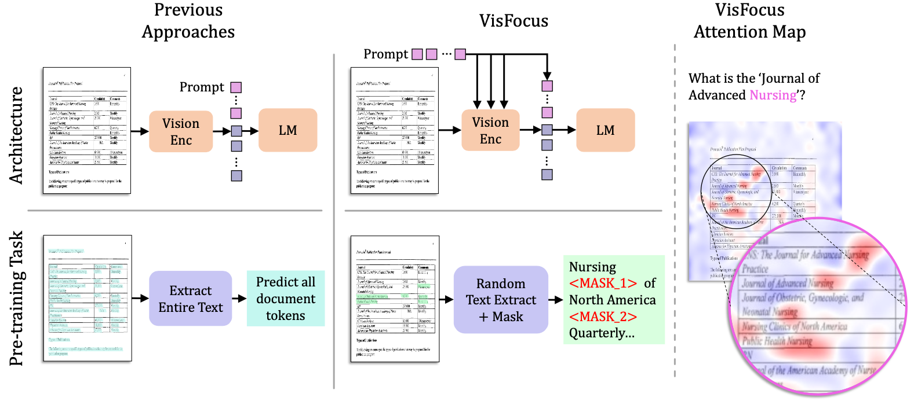
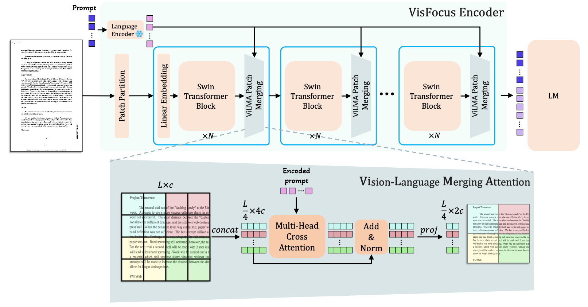
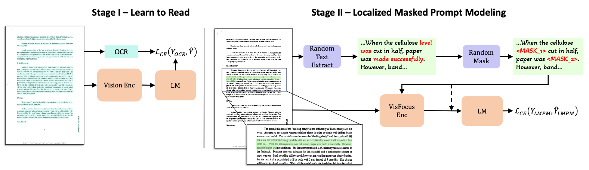

# <p style="text-align: center;">VisFocus: Prompt-Guided Vision Encoders for OCR-Free Dense Document Understanding</p>

<p align="center">
  <a href="https://www.amazon.science/author/ofir-abramovich">Ofir Abramovich</a> •
  <a href="https://www.amazon.science/author/Niv-Nayman">Niv Nayman</a> •
  <a href="https://www.amazon.science/author/Sharon-Fogel">Sharon Fogel</a> •
  <a href="https://www.amazon.science/author/Inbal-Lavi">Inbal Lavi</a> • <br>
  <a href="https://www.amazon.science/author/Ron-Litman">Ron Litman</a> •
  <a href="https://www.amazon.science/author/Shahar-Tsiper">Shahar Tsiper</a> •
  <a href="https://www.amazon.science/author/Royee-Tichauer">Royee Tichauer</a> •
  <a href="https://www.amazon.science/author/Srikar-Appalaraju">Srikar Appalaraju</a> •
  <a href="https://www.amazon.science/author/Shai-Mazor">Shai Mazor</a> •
  <a href="https://www.amazon.science/author/R-Manmatha">R. Manmatha</a>
</p>


**Abstract.** In recent years, notable advancements have been made in the domain of visual document understanding, with the prevailing architecture comprising a cascade of vision and language models. The text component can either be extracted explicitly with the use of external OCR models in OCR-based approaches, or alternatively, the vision model can be endowed with reading capabilities in OCR-free approaches.  Typically, the queries to the model are input exclusively to the language component, necessitating the visual features to encompass the entire document. In this paper, we present *VisFocus*, an OCR-free method designed to better exploit the vision encoder's capacity by coupling it directly with the language prompt.
To do so, we replace the down-sampling layers with layers that receive the input prompt and allow highlighting relevant parts of the document, while disregarding others.
We pair the architecture enhancements with a novel pre-training task, using language masking on a snippet of the document text fed to the visual encoder in place of the prompt, to empower the model with focusing capabilities. Consequently, VisFocus learns to allocate its attention to text patches pertinent to the provided prompt.
Our experiments demonstrate that this prompt-guided visual encoding approach significantly improves performance, achieving state-of-the-art results on various benchmarks.
\
\


This is an official PyTorch implementation of the paper [VisFocus: Prompt-Guided Vision Encoders for OCR-Free Dense Document Understanding](ARXIV_LINK)


* * *
## Repository Structure
```
VisFocus
├── checkpoints
│   └── ...
├── configs
│   ├── datasets/
│   └── vision/
├── expts
│   └── ...
├── requirements.txt
├── scripts
│   └── ...
└── visfocus
    ├── data/
    ├── datasets/
    ├── engine/
    ├── metrics/
    ├── models/
    └── utils/
```

* * *
## Model Architecture
 

*VisFocus* enables the vision model to better align visual features to the input prompt. Unlike previous approaches, VisFocus inputs the prompt not only to the language model, but to the vision encoder as well. This is done using ViLMA layer, a Vision-Language Merging Layres, trained to model the visual document features with respect to the input question.

* * *
## Requirements
* CUDA >= 11.8
* PyTorch 2.1.0
* torchvision 0.16.0
* transformers 4.31.0
* deepspeed >= 0.14.2

* * *
## Enviroment Setup
```
> git clone https://github.com/amazon-science/visfocus.git
> conda create -n vf python=3.8.10 -y
> conda activate vf
> cd VisFocus/
> pip install -r requirements.txt
```

Once the evnviroment is set, all training and evaluation scripts can be found at `./scripts/` directory. For reproduction, follow the configurations as in `./expts/test_expts/` or alternatively, you can run directly using `DeepSpeed`/`Torchrun`/`Python`. For example:
```
deepspeed --num_gpus=8 scripts/train_vqa_model_from_config.py
    --model_config_path=PATH/TO/MODEL/YAML \
    --data_config_path=PATH/TO/DATA/YAML \
    --do_train=True \
    --dataloader_num_workers=8 \
    --warmup_steps=2000 \
    --learning_rate=1e-4 \
    --lr_scheduler_type=cosine \
    --weight_decay=0.05 \
    --max_steps=400000 \
    --bf16=True \
    --gradient_accumulation_steps=4 \
    --resume_from_checkpoint=PATH/TO/CKPT \
    --run_name=RUN_NAME \
    --deepspeed=PATH/TO/DS/JSON \
    --output_dir=OUTDIR
```

* * *
## Training and Evaluation
 

VisFocus utilizes pretrained SwinV2 (on IN) and T5 (on C4) as vision and language components.
The first pre-training stage (refered as LtR) shifts the visual domain and grants the model reading capabilities.
Then, the second pre-training stage (refered as LMPM) encourages prompt-guided encoding, such that it is focused on the relevant parts of the documents.
The final stage is task-specific fine-tuning on prompt-conditioned tasks.

Instructions for pre-training, fintuning and evaluation can be found below.

* * *
### Training
The following scripts allocate 8 GPUs for model training and preform LtR/LMPM pre-training for 200/400K steps on IDL (modify dataset paths in `expts/test_expts/pretrain_idl_v2_accum4_f32/pretraining_wds_data_args.yaml`).
Since IDL is a large corpus (>20M high resolution document images), [webdataset](https://github.com/webdataset/webdataset) is used to access the data from S3 servers.

All training experiments utilize the [DeepSpeed](https://www.deepspeed.ai/) stage-2 traiaining pipeline. All training scripts ending with '_ds.sh' utilize DeepSpeed.

A configuration directory should contain:
* `vqa_data_args.yaml`/`pretraining_wds_data_args`: data configurations
* `vqa_model_args.yaml`/`model_args.yaml`: model configurations
* `default_args_vqa_finetune.txt`/`default_args_pretrain.txt`: training hyperparameters
* `ds.json`: DeepSpeed file (for all our experiments we the stage-II pipline, see config example)

#### LtR Pre-training (stage-I)
For Stage-I pre-training, run:

`> ./scripts/pretrain_ds.sh expts/pretrain_idl_v2_accum4_f32`

See `./config` directory for more details.

<u>Pretrained Checkpoints:</u>
| VisFocus-S   | VisFocus-B  |
|:---:|:---:|
| [download]() | [download]() |

#### LMPM Pre-training (stage II)
For Stage II pre-training, run:

`> ./scripts/pretrain_ds.sh expts/pretrain_idl_v2_accum4_f32__mpm_altConcat`
This will  load Stage I pretrained checkpoint and start training Stage II.

<u>Pretrained Checkpoints:</u>
| | VisFocus-S   | VisFocus-B  |
|:---:|:---:|:---:|
| .pth | [download]() | [download]() |
| HF Hub | - | `ofir1080/visfocus-base` |

#### Fintuning (stage III)
For VQA fine-tuning, run:

`> ./scripts/vqa_finetune_ds.sh path/to/config/directory`

* * *
### Evaluation
For every dataset run the following:

`> ./scripts/vqa_finetune_eval_<DATASET-NAME>.sh path/to/expt/dierectory`

*Note:*
* Checkpoints are stored in a [HuggingFace format](https://huggingface.co/docs/accelerate/en/usage_guides/checkpoint)
* The scripts are benchmark-specific, since different metrics and test/val sets are defined for different benchmarks

#### Inference using HuggingFace
will be avialable soon
```

```

* * *
## Results

### DocVQA
[Dataset link](https://www.docvqa.org/datasets)
| Method        | Resolution    | LtR   | LMPM  | ANLS  | Checkpoint | HF |
|:---:|:---:|:---:|:---:|:---:|:---:|:---:|
| VisFocus-S    |1536 x 768     |&check;|&check;| 68.6  | [download]() | `ofir1080/visfocus-small-docvqa` |
| VisFocus-B    |1536 x 768    |&check;|&check;| 72.9   | [download]() | `ofir1080/visfocus-base-docvqa` |

### InfographicVQA
[Dataset link](https://www.docvqa.org/datasets/infographicvqa)
| Method        | Resolution    | LtR   | LMPM  | ANLS  | Checkpoint |
|:---:|:---:|:---:|:---:|:---:|:---:|
| VisFocus-S    |1536 x 768     |&check;|&check;| 28.5  | [download]() |
| VisFocus-B    |1536 x 768    |&check;|&check;| 31.9   | [download]() |

### ChartQA
[Dataset link](https://github.com/vis-nlp/ChartQA)
| Method        | Resolution    | LtR   | LMPM  | Rlaxed Acc.  | Checkpoint |
|:---:|:---:|:---:|:---:|:---:|:---:|
| VisFocus-S    |1536 x 768     |&check;|&check;| 53.0  | [download]() |
| VisFocus-B    |1536 x 768    |&check;|&check;| 57.1   | [download]() |

### OCR-VQA
[Dataset link](https://github.com/vis-nlp/ChartQA)
| Method        | Resolution    | LtR   | LMPM  | Exact Match  | Checkpoint |
|:---:|:---:|:---:|:---:|:---:|:---:|
| VisFocus-S    |1536 x 768     |&check;|&check;| 67.3  | [download]() |
| VisFocus-B    |1536 x 768    |&check;|&check;| 70.0   | [download]() |

### AI2D
[Dataset link](https://github.com/vis-nlp/ChartQA)
| Method        | Resolution    | LtR   | LMPM  | Exact Match  | Checkpoint |
|:---:|:---:|:---:|:---:|:---:|:---:|
| VisFocus-S    |1536 x 768     |&check;|&check;| 42.6  | [download]() |
| VisFocus-B    |1536 x 768    |&check;|&check;| 47.8   | [download]() |

## Security

See [CONTRIBUTING](CONTRIBUTING.md#security-issue-notifications) for more information.

## License

This project is licensed under the Apache-2.0 License.

* * *
## Citation

    @article{abramovich2024visfocus,
      title={VisFocus: Prompt-guided vision encoders for OCR-free dense document understanding},
      author={Abramovich, Ofir and Nayman, Niv and Fogel, Sharon and Lavi, Inbal and Litman, Ron and Tsiper, Shahar and Tichauer, Royee and Appalaraju, Srikar and Mazor, Shai and Manmatha, R},
      journal={arXiv preprint arXiv:2407.12594},
      year={2024}
    }
